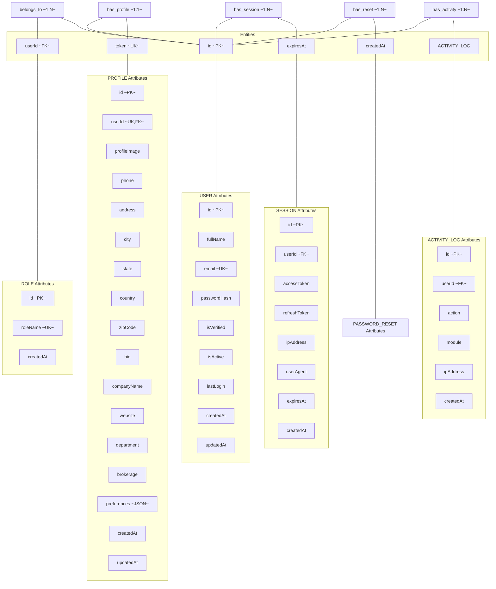

# Chen Notation Diagram

## Chen ER Diagram (Mermaid Representation)

## Chen Notation Key

| Symbol | Meaning |
|---|---|
| **PK** | Primary Key — uniquely identifies each entity instance |
| **UK** | Unique Key — ensures no duplicate values |
| **FK** | Foreign Key — references a primary key in another entity |
| **1:1** | One-to-One — exactly one instance of entity A relates to one instance of entity B |
| **1:N** | One-to-Many — one instance of entity A relates to multiple instances of entity B |
| **N:M** | Many-to-Many — multiple instances of both entities relate to each other |

## Cardinality Matrix

| Entity A | Entity B | Relationship | Cardinality | Delete Rule |
|---|---|---|---|---|
| User | Role | belongs_to | N:1 (Many users belong to one role) | Restrict (cannot delete role with users) |
| User | Profile | has_profile | 1:1 (One user has one profile) | Cascade (deleting user deletes profile) |
| User | Session | has_session | 1:N (One user has many sessions) | Cascade (deleting user deletes all sessions) |
| User | PasswordReset | has_reset | 1:N (One user has many resets) | Cascade (deleting user deletes all resets) |
| User | ActivityLog | has_activity | 1:N (One user has many logs) | Cascade (deleting user deletes all logs) |

## Weak Entity Analysis

- **Session** is a **weak entity** relative to User — a session cannot exist without its owning user
- **PasswordReset** is a **weak entity** relative to User — a reset token cannot exist without its owning user
- **ActivityLog** is a **weak entity** relative to User — a log entry cannot exist without its owning user
- **Profile** is a **regular entity** but with a mandatory relationship to User (unique FK constraint)

## Domain Constraints

| Attribute | Domain | Constraints |
|---|---|---|
| email | String | Unique, not null, must match email format |
| passwordHash | String | Not null, bcrypt hashed (12 salt rounds) |
| roleName | String | Unique, not null, one of: Admin, Vendor, Client, Support Staff, Broker |
| isVerified | Boolean | Default false |
| isActive | Boolean | Default true |
| expiresAt (Session) | DateTime | Not null, must be future timestamp |
| expiresAt (PasswordReset) | DateTime | Not null, typically 1 hour from creation |
| token (PasswordReset) | String | Unique, not null, crypto-random generated |
| action (ActivityLog) | String | Not null, one of defined action constants |
| module (ActivityLog) | String | Not null, one of: auth, profile, session, password, admin |
| preferences (Profile) | JSON | Optional, stores user preferences as JSON object |